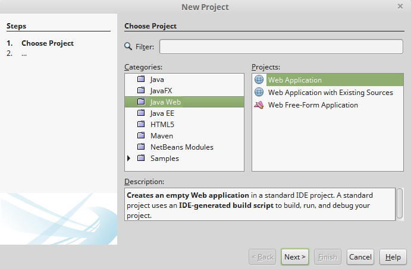
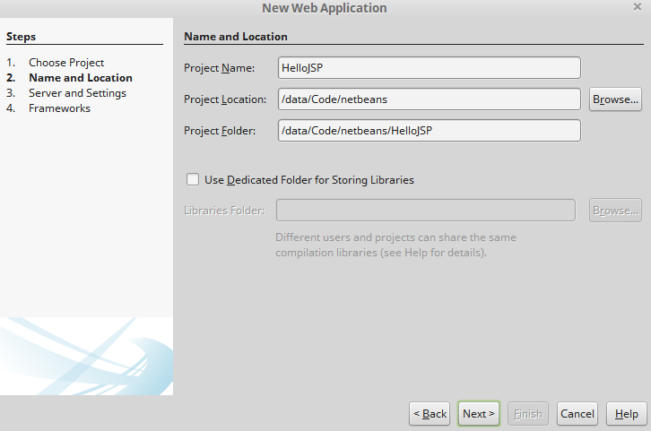
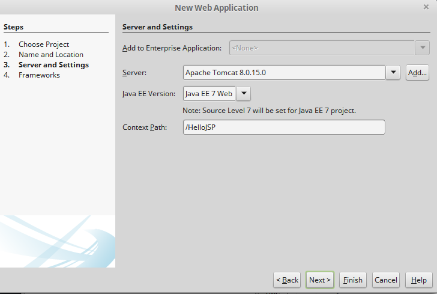
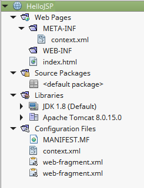

00-03、从JSP开始
---

## 创建web项目
打开netbeans，在菜单栏依次选择“File”、“New Project...”，然后

1、选择java web：  
  

2、项目名称、路径：  


3、选择使用的web容器，编写ContextPath：  


生成的web项目结构如下：  


index.html的内容如下：
```html
<!DOCTYPE html>
<!--
To change this license header, choose License Headers in Project Properties.
To change this template file, choose Tools | Templates
and open the template in the editor.
-->
<html>
    <head>
        <title>TODO supply a title</title>
        <meta charset="UTF-8">
        <meta name="viewport" content="width=device-width, initial-scale=1.0">
    </head>
    <body>
        <div>TODO write content</div>
    </body>
</html>
```

`context.xml`的内容如下：
```xml
<?xml version="1.0" encoding="UTF-8"?>
<Context antiJARLocking="true" path="/HelloJSP"/>
```

`apache-tomcat-8.0.15/conf/server.xml`中关于端口的配置如下：
```xml
<Connector port="8080" protocol="HTTP/1.1"
       connectionTimeout="20000"
       redirectPort="8443" />
```

运行项目后，netbeans的输出信息如下：
```
ant -f /data/Code/netbeans/HelloJSP -Dnb.internal.action.name=run -Ddirectory.deployment.supported=true -DforceRedeploy=false -Dnb.wait.for.caches=true -Dbrowser.context=/data/Code/netbeans/HelloJSP run
init:
deps-module-jar:
deps-ear-jar:
deps-jar:
library-inclusion-in-archive:
library-inclusion-in-manifest:
compile:
compile-jsps:
Incrementally deploying http://localhost:8084/HelloJSP
Completed incremental distribution of http://localhost:8084/HelloJSP
run-deploy:
Browsing: http://localhost:8084/HelloJSP
run-display-browser:
run:
```

使用浏览器访问`http://localhost:8084/HelloJSP/`，能看到`TODO write content`。

**那么问题来了，为什么配置的是8080,访问时却用8084端口？**  
答案是：这个端口是netbeans启动tomcat时配置的。

看一下启动命令：
```shell
$ ps -ef | grep 'tomcat' | grep -v grep
letian     390 24314  0 09:24 ?        00:00:08 /data/Apps/jdk1.8.0_20/bin/java -Djava.util.logging.config.file=/home/letian/.netbeans/8.0.2/apache-tomcat-8.0.15.0_base/conf/logging.properties -Djava.util.logging.manager=org.apache.juli.ClassLoaderLogManager -Dhttp.nonProxyHosts=localhost|127.0.0.1|myhost -Djava.endorsed.dirs=/data/Apps/apache-tomcat-8.0.15/endorsed -classpath /data/Apps/apache-tomcat-8.0.15/bin/bootstrap.jar:/data/Apps/apache-tomcat-8.0.15/bin/tomcat-juli.jar -Dcatalina.base=/home/letian/.netbeans/8.0.2/apache-tomcat-8.0.15.0_base -Dcatalina.home=/data/Apps/apache-tomcat-8.0.15 -Djava.io.tmpdir=/home/letian/.netbeans/8.0.2/apache-tomcat-8.0.15.0_base/temp org.apache.catalina.startup.Bootstrap start

$ grep -r '8084' /home/letian/.netbeans/8.0.2 # 可以看到很多结果
...
```

也就是说，实际使用的是`/home/letian/.netbeans/8.0.2/apache-tomcat-8.0.15.0_base/conf`
下的配置。在``/home/letian/.netbeans/8.0.2/apache-tomcat-8.0.15.0_base/conf/Catalina/localhost/HelloJSP.xml`中有以下内容：
```xml
<Context antiJARLocking="true" docBase="/data/Code/netbeans/HelloJSP/build/web" path="/HelloJSP"/>
```
这意味着访问`http://localhost:8084/HelloJSP/`时对应的web应用部署在HelloJSP项目
的`build/web/`目录下。


## 基于JSP的hello world
删除index.html，新建index.jsp，内容如下：
```html
<%@page contentType="text/html" pageEncoding="UTF-8"%>
<!DOCTYPE html>
<html>
    <head>
        <meta http-equiv="Content-Type" content="text/html; charset=UTF-8">
        <title>JSP Page</title>
    </head>
    <body>
        <%
            String data="hello world";
            boolean flag=true;
            if (flag==true) {
                out.println("<h1>" +data.toUpperCase()+ "</h1>");
            }
        %>
    </body>
</html>
```
运行项目，访问`http://localhost:8084/HelloJSP/`，可以看到`HELLO WORLD`。

JSP在部署时会被转换成servlet，`/home/letian/.netbeans/8.0.2/apache-tomcat-8.0.15.0_base/work/Catalina/localhost/HelloJSP/org/apache/jsp`中的`index_jsp.java`就是对应的servlet。其内容如下：
```java
/*
 * Generated by the Jasper component of Apache Tomcat
 * Version: Apache Tomcat/8.0.15
 * Generated at: 2015-09-18 02:43:43 UTC
 * Note: The last modified time of this file was set to
 *       the last modified time of the source file after
 *       generation to assist with modification tracking.
 */
package org.apache.jsp;

import javax.servlet.*;
import javax.servlet.http.*;
import javax.servlet.jsp.*;

public final class index_jsp extends org.apache.jasper.runtime.HttpJspBase
    implements org.apache.jasper.runtime.JspSourceDependent {

  private static final javax.servlet.jsp.JspFactory _jspxFactory =
          javax.servlet.jsp.JspFactory.getDefaultFactory();

  private static java.util.Map<java.lang.String,java.lang.Long> _jspx_dependants;

  private javax.el.ExpressionFactory _el_expressionfactory;
  private org.apache.tomcat.InstanceManager _jsp_instancemanager;

  public java.util.Map<java.lang.String,java.lang.Long> getDependants() {
    return _jspx_dependants;
  }

  public void _jspInit() {
    _el_expressionfactory = _jspxFactory.getJspApplicationContext(getServletConfig().getServletContext()).getExpressionFactory();
    _jsp_instancemanager = org.apache.jasper.runtime.InstanceManagerFactory.getInstanceManager(getServletConfig());
  }

  public void _jspDestroy() {
  }

  public void _jspService(final javax.servlet.http.HttpServletRequest request, final javax.servlet.http.HttpServletResponse response)
        throws java.io.IOException, javax.servlet.ServletException {

final java.lang.String _jspx_method = request.getMethod();
if (!"GET".equals(_jspx_method) && !"POST".equals(_jspx_method) && !"HEAD".equals(_jspx_method) && !javax.servlet.DispatcherType.ERROR.equals(request.getDispatcherType())) {
response.sendError(HttpServletResponse.SC_METHOD_NOT_ALLOWED, "JSPs only permit GET POST or HEAD");
return;
}

    final javax.servlet.jsp.PageContext pageContext;
    javax.servlet.http.HttpSession session = null;
    final javax.servlet.ServletContext application;
    final javax.servlet.ServletConfig config;
    javax.servlet.jsp.JspWriter out = null;
    final java.lang.Object page = this;
    javax.servlet.jsp.JspWriter _jspx_out = null;
    javax.servlet.jsp.PageContext _jspx_page_context = null;


    try {
      response.setContentType("text/html;charset=UTF-8");
      pageContext = _jspxFactory.getPageContext(this, request, response,
      			null, true, 8192, true);
      _jspx_page_context = pageContext;
      application = pageContext.getServletContext();
      config = pageContext.getServletConfig();
      session = pageContext.getSession();
      out = pageContext.getOut();
      _jspx_out = out;

      out.write("\n");
      out.write("<!DOCTYPE html>\n");
      out.write("<html>\n");
      out.write("    <head>\n");
      out.write("        <meta http-equiv=\"Content-Type\" content=\"text/html; charset=UTF-8\">\n");
      out.write("        <title>JSP Page</title>\n");
      out.write("    </head>\n");
      out.write("    <body>\n");
      out.write("        ");

            String data="hello world";
            boolean flag=true;
            if (flag==true) {
                out.println("<h1>" +data.toUpperCase()+ "</h1>");
            }

      out.write("\n");
      out.write("    </body>\n");
      out.write("</html>\n");
    } catch (java.lang.Throwable t) {
      if (!(t instanceof javax.servlet.jsp.SkipPageException)){
        out = _jspx_out;
        if (out != null && out.getBufferSize() != 0)
          try {
            if (response.isCommitted()) {
              out.flush();
            } else {
              out.clearBuffer();
            }
          } catch (java.io.IOException e) {}
        if (_jspx_page_context != null) _jspx_page_context.handlePageException(t);
        else throw new ServletException(t);
      }
    } finally {
      _jspxFactory.releasePageContext(_jspx_page_context);
    }
  }
}
```
感受一下这段代码吧～

关于JSP就介绍这么多。**需要记住的是：JSP最合适的用途是用作MVC中的视图，而不是和HTML一起混合编码
（例如把从数据库拉取数据也放入JSP中写）**

要了解更多，请参考下面的相关资料。

## JSP相关资料
[JSP 教程](http://www.runoob.com/jsp/jsp-tutorial.html)
