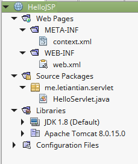
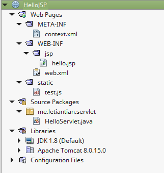

00-04、理解Servlet
---

本文依然使用[003、从JSP开始](./003.md)中创建的项目HelloJSP。

本文主要有以下内容：  

* 如何使用Servlet编写Hello Servlet  
* 如何将Servlet与URL对应起来   
* Servlet如何调用JSP  
* Servlet如何返回JSON数据  
* 如何编写一个Dispatcher  


## Hello Servlet
项目结构如下：



`HelloServlet.java`内容如下：
```java
package me.letiantian.servlet;

import java.io.IOException;
import java.io.PrintWriter;
import javax.servlet.ServletException;
import javax.servlet.http.HttpServlet;
import javax.servlet.http.HttpServletRequest;
import javax.servlet.http.HttpServletResponse;

public class HelloServlet extends HttpServlet {

    protected void processRequest(HttpServletRequest request, HttpServletResponse response)
            throws ServletException, IOException {
        response.setContentType("text/html;charset=UTF-8");
        try (PrintWriter out = response.getWriter()) {
            out.println("<!DOCTYPE html>");
            out.println("<html>");
            out.println("<head>");
            out.println("<title>Servlet HelloServlet</title>");            
            out.println("</head>");
            out.println("<body>");
            out.println("<h1>Servlet HelloServlet at " + request.getContextPath() + "</h1>");
            out.println("</body>");
            out.println("</html>");
        }
    }

    @Override
    protected void doGet(HttpServletRequest request, HttpServletResponse response)
            throws ServletException, IOException {
        processRequest(request, response);
    }

    @Override
    protected void doPost(HttpServletRequest request, HttpServletResponse response)
            throws ServletException, IOException {
        processRequest(request, response);
    }

}

```
HTTP最常见的方法是GET和POST，在一个Servlet中对应的处理方法分别是doGet()和doPost()。
`response.setContentType("text/html;charset=UTF-8");` 用来设置HTTP响应头中的Content-Type。
PrintWriter对象out的输出内容则是响应正文。


`web.xml`内容如下：
```xml
<?xml version="1.0" encoding="UTF-8"?>
<web-app version="3.1" xmlns="http://xmlns.jcp.org/xml/ns/javaee" xmlns:xsi="http://www.w3.org/2001/XMLSchema-instance" xsi:schemaLocation="http://xmlns.jcp.org/xml/ns/javaee http://xmlns.jcp.org/xml/ns/javaee/web-app_3_1.xsd">
    <servlet>
        <servlet-name>HelloServlet</servlet-name>
        <servlet-class>me.letiantian.servlet.HelloServlet</servlet-class>
    </servlet>
    <servlet-mapping>
        <servlet-name>HelloServlet</servlet-name>
        <url-pattern>/HelloServlet</url-pattern>
    </servlet-mapping>
    <session-config>
        <session-timeout>
            30
        </session-timeout>
    </session-config>
</web-app>
```
在这个配置中，`me.letiantian.servlet.HelloServlet`与URL`/HelloServlet`对应。
`session-timeout`设置了session的有效时间，单位是分钟（不过目前的程序里还没用过session）。

浏览器访问`http://127.0.0.1:8084/HelloJSP`会显示404；访问`http://127.0.0.1:8084/HelloJSP/HelloServlet`会显示`Servlet HelloServlet at /HelloJSP`，这也正是`me.letiantian.servlet.HelloServlet`输出的HTML的渲染结果。


### 也可以使用注解将Servlet和URL对应起来

首先清空web.xml中关于URL的配置，web.xml最终内容如下：
```xml
<?xml version="1.0" encoding="UTF-8"?>
<web-app version="3.1" xmlns="http://xmlns.jcp.org/xml/ns/javaee" xmlns:xsi="http://www.w3.org/2001/XMLSchema-instance" xsi:schemaLocation="http://xmlns.jcp.org/xml/ns/javaee http://xmlns.jcp.org/xml/ns/javaee/web-app_3_1.xsd">

    <session-config>
        <session-timeout>
            30
        </session-timeout>
    </session-config>

</web-app>

```
然后对`me.letiantian.servlet.HelloServlet`类略做修改：
```java
package me.letiantian.servlet;

import java.io.IOException;
import java.io.PrintWriter;
import javax.servlet.ServletException;
import javax.servlet.http.HttpServlet;
import javax.servlet.http.HttpServletRequest;
import javax.servlet.http.HttpServletResponse;

import javax.servlet.annotation.WebServlet;

@WebServlet("/HelloServlet")
public class HelloServlet extends HttpServlet {
	// ......
}
```

重新启动项目，浏览器访问效果和之前是相同的。


## Servlet调用JSP
改写me.letiantian.servlet.HelloServlet类，内容如下：

```java
package me.letiantian.servlet;

import java.io.IOException;
import java.io.PrintWriter;
import javax.servlet.RequestDispatcher;
import javax.servlet.ServletException;
import javax.servlet.http.HttpServlet;
import javax.servlet.http.HttpServletRequest;
import javax.servlet.http.HttpServletResponse;

import javax.servlet.annotation.WebServlet;

@WebServlet("/HelloServlet")
public class HelloServlet extends HttpServlet {

    protected void processRequest(HttpServletRequest request, HttpServletResponse response)
            throws ServletException, IOException {
        response.setContentType("text/html;charset=UTF-8");
        request.setAttribute("title", "Hello Servlet");
        request.setAttribute("content", "你好");
        RequestDispatcher rd = request.getRequestDispatcher("/WEB-INF/jsp/hello.jsp");
        rd.forward(request, response);
    }

    @Override
    protected void doGet(HttpServletRequest request, HttpServletResponse response)
            throws ServletException, IOException {
        processRequest(request, response);
    }

    @Override
    protected void doPost(HttpServletRequest request, HttpServletResponse response)
            throws ServletException, IOException {
        processRequest(request, response);
    }

}
```

在`WEB-INF/`下创建目录`jsp`，然后在`jsp`目录下新建`hello.jsp`，内容如下：
```html
<!DOCTYPE html>
<html>
    <head>
        <meta http-equiv="Content-Type" content="text/html; charset=UTF-8">
        <title>${title}</title>
    </head>
    <body>
        <h1>${content}</h1>
    </body>
</html>
```

重启该项目，访问`http://127.0.0.1:8084/HelloJSP/HelloServlet`：
```plain
$ curl -i  http://127.0.0.1:8084/HelloJSP/HelloServlet
HTTP/1.1 200 OK
Server: Apache-Coyote/1.1
Set-Cookie: JSESSIONID=7CCCFD5467F8330066F827623802FB23; Path=/HelloJSP/; HttpOnly
Content-Type: text/html;charset=UTF-8
Content-Length: 215
Date: Fri, 18 Sep 2015 08:09:58 GMT


<!DOCTYPE html>
<html>
    <head>
        <meta http-equiv="Content-Type" content="text/html; charset=UTF-8">
        <title>Hello Servlet</title>
    </head>
    <body>
        <h1>你好</h1>
    </body>
</html>
```

## CSS等静态文件放在什么地方
在项目下建立static目录，再这个目录下添加`test.js`，内容如下：
```
console.log("hello world");
```
在`web.xml`添加以下内容：
```xml
<servlet-mapping>  
    <servlet-name>default</servlet-name>
    <url-pattern>*.jpg</url-pattern>   
</servlet-mapping>  

<servlet-mapping>  
    <servlet-name>default</servlet-name>
    <url-pattern>*.png</url-pattern>   
</servlet-mapping>  

<servlet-mapping>    
    <servlet-name>default</servlet-name>  
    <url-pattern>*.js</url-pattern>  
</servlet-mapping>  

<servlet-mapping>    
    <servlet-name>default</servlet-name>    
    <url-pattern>*.css</url-pattern>   
</servlet-mapping>
```
此时，项目结构如下：  


启动项目，访问
```plain
$ curl -i http://localhost:8084/HelloJSP/static/test.js
HTTP/1.1 200 OK
Server: Apache-Coyote/1.1
Accept-Ranges: bytes
ETag: W/"27-1442566151000"
Last-Modified: Fri, 18 Sep 2015 08:49:11 GMT
Content-Type: application/javascript
Content-Length: 27
Date: Fri, 18 Sep 2015 08:58:00 GMT

console.log("hello world");
```

```plain
$ curl -i http://localhost:8084/HelloJSP/static/test.js?time=123
HTTP/1.1 200 OK
Server: Apache-Coyote/1.1
Accept-Ranges: bytes
ETag: W/"27-1442566151000"
Last-Modified: Fri, 18 Sep 2015 08:49:11 GMT
Content-Type: application/javascript
Content-Length: 27
Date: Fri, 18 Sep 2015 08:58:09 GMT

console.log("hello world");
```

## Servlet如何返回JSON数据

将
```
response.setContentType("text/html;charset=UTF-8");
```
修改为
```
response.setContentType("application/json;charset=UTF-8");
```
。

`out.println`输出JSON格式的字符串即可。


## 编写Dispatcher
基于以上的学习，已经可以编写一个分发器了。
将HelloServlet.java修改为DispatcherServlet.java，内容修改为：
```java
package me.letiantian.servlet;

import java.io.IOException;
import java.io.PrintWriter;
import javax.servlet.ServletException;
import javax.servlet.http.HttpServlet;
import javax.servlet.http.HttpServletRequest;
import javax.servlet.http.HttpServletResponse;

import javax.servlet.annotation.WebServlet;

@WebServlet("/")
public class HelloServlet extends HttpServlet {

    protected void processRequest(HttpServletRequest request, HttpServletResponse response)
            throws ServletException, IOException {
        response.setContentType("text/plain;charset=UTF-8");
        try (PrintWriter out = response.getWriter()) {
            out.println("context: " + request.getContextPath());
            out.println("request uri: " + request.getRequestURI());
            out.println("params: " + request.getParameterMap());
        }
    }

    @Override
    protected void doGet(HttpServletRequest request, HttpServletResponse response)
            throws ServletException, IOException {
        processRequest(request, response);
    }

    @Override
    protected void doPost(HttpServletRequest request, HttpServletResponse response)
            throws ServletException, IOException {
        processRequest(request, response);
    }

}
```
运行项目，访问结果如下：
```
$ curl http://localhost:8084/HelloJSP/user
context: /HelloJSP
request uri: /HelloJSP/user
params: {}
```
```
$ curl http://localhost:8084/HelloJSP/user?name=letian
context: /HelloJSP
request uri: /HelloJSP/user
params: {name=[Ljava.lang.String;@49ea47b4}
```
```
$ curl http://localhost:8084/HelloJSP/static/test.js
console.log("hello world");
```
（这个代码并没什么用～）

从这段代码中可以看到，我们可以通过request对象得到HTTP请求信息，特别是request URI。在这个程序的基础上，我们
可以继续扩充它，使得其遇到某个URI，就调用指定的处理函数。慢慢地补充，一个框架就出来了。


## 资料

本节中，JSP使用了表达式语言，可以参考：  
[JSTL 入门: 表达式语言](http://www.ibm.com/developerworks/cn/java/j-jstl0211/index.html)  
[JSP 表达式语言](http://www.runoob.com/jsp/jsp-expression-language.html)  
