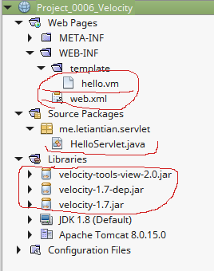
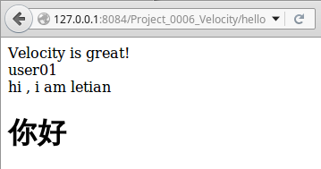

00-06、使用velocity模板引擎
---

> Velocity is a Java-based template engine. It permits anyone to use a simple yet powerful template language to reference objects defined in Java code.

> When Velocity is used for web development, Web designers can work in parallel with Java programmers to develop web sites according to the Model-View-Controller (MVC) model, meaning that web page designers can focus solely on creating a site that looks good, and programmers can focus solely on writing top-notch code. Velocity separates Java code from the web pages, making the web site more maintainable over its lifespan and providing a viable alternative to Java Server Pages (JSPs) or PHP.

以上内容摘自[velocity的官方首页](http://velocity.apache.org/engine/devel/)。

以下通过示例来说明velocity的使用。

## 项目结构
在[http://velocity.apache.org/download.cgi](http://velocity.apache.org/download.cgi)中下载velocity-1.7、velocity-tools-2.0。

参考[00-03、从JSP开始](./00-03.md)所述，创建项目`Project_0006_Velocity`，导入相关的jar，编写代码。

项目结构如下：  


对于新增的jar，放到/WEB-INF/lib目录即可。但当多个webApp要使用时，放入CLASSPATH或Servlet容器（如Tomcat）的顶层lib是最好的选择.

## 代码
web.xml（在这一节，该文件可以忽略）：  
```xml
<?xml version="1.0" encoding="UTF-8"?>
<web-app version="3.1" xmlns="http://xmlns.jcp.org/xml/ns/javaee" xmlns:xsi="http://www.w3.org/2001/XMLSchema-instance" xsi:schemaLocation="http://xmlns.jcp.org/xml/ns/javaee http://xmlns.jcp.org/xml/ns/javaee/web-app_3_1.xsd">

    <servlet-mapping>  
        <servlet-name>default</servlet-name>
        <url-pattern>*.jpg</url-pattern>   
    </servlet-mapping>  

    <servlet-mapping>  
        <servlet-name>default</servlet-name>
        <url-pattern>*.png</url-pattern>   
    </servlet-mapping>  

    <servlet-mapping>    
        <servlet-name>default</servlet-name>  
        <url-pattern>*.js</url-pattern>  
    </servlet-mapping>  

    <servlet-mapping>    
        <servlet-name>default</servlet-name>    
        <url-pattern>*.css</url-pattern>   
    </servlet-mapping>

    <session-config>
        <session-timeout>
            30
        </session-timeout>
    </session-config>

</web-app>
```

hello.vm:  
```html
<html>
<head>
<meta http-equiv="Content-Type" content="text/html; charset=utf-8">
</head>
<body>
#set( $this = "Velocity")
$this is great!  <br/>
$name  <br/>
hi  , i am letian
<h1>你好</h1>
</body>
</html>
```

HelloServlet.java：  
```java
package me.letiantian.servlet;

import java.io.IOException;
import java.io.PrintWriter;
import javax.servlet.ServletException;
import javax.servlet.annotation.WebServlet;
import javax.servlet.http.HttpServlet;
import javax.servlet.http.HttpServletRequest;
import javax.servlet.http.HttpServletResponse;

import java.util.Properties;
import java.io.StringWriter;
import org.apache.velocity.app.Velocity;
import org.apache.velocity.app.VelocityEngine;
import org.apache.velocity.VelocityContext;


@WebServlet(name = "HelloServlet", urlPatterns = {"/hello"})
public class HelloServlet extends HttpServlet {

    protected void processRequest(HttpServletRequest request, HttpServletResponse response)
            throws ServletException, IOException {
        response.setContentType("text/html;charset=UTF-8");
        PrintWriter out = response.getWriter();

        Properties properties=new Properties();
        properties.setProperty("resource.loader", "webapp");
        properties.setProperty("webapp.resource.loader.class", "org.apache.velocity.tools.view.servlet.WebappLoader");
        properties.setProperty("webapp.resource.loader.path", "/WEB-INF/template");
        properties.setProperty(Velocity.ENCODING_DEFAULT, "UTF-8");
        properties.setProperty(Velocity.INPUT_ENCODING, "UTF-8");
        properties.setProperty(Velocity.OUTPUT_ENCODING, "UTF-8");
        VelocityEngine velocityEngine = new VelocityEngine(properties);
        velocityEngine.setApplicationAttribute("javax.servlet.ServletContext", request.getServletContext());

        VelocityContext context=new VelocityContext();
        context.put("name", "user01");
        StringWriter sw = new StringWriter();
        velocityEngine.mergeTemplate("hello.vm", "utf-8", context, sw);
//        velocityEngine.mergeTemplate("hello.vm", "utf-8", context, sw);      //如果这行不注释，hello.vm的内容会出现两次
        out.println(sw.toString());

    }

    @Override
    protected void doGet(HttpServletRequest request, HttpServletResponse response)
            throws ServletException, IOException {
        processRequest(request, response);
    }

    @Override
    protected void doPost(HttpServletRequest request, HttpServletResponse response)
            throws ServletException, IOException {
        processRequest(request, response);
    }

}
```

运行项目，用浏览器访问`http://127.0.0.1:8084/Project_0006_Velocity/hello`：



## 改进上面的代码

在WEB-INF目录下创建`velocity.properties`文件，其内容如下：
```plain
resource.loader=webapp
webapp.resource.loader.class=org.apache.velocity.tools.view.servlet.WebappLoader
webapp.resource.loader.path=/WEB-INF/template/
input.encoding=utf-8
output.encoding=utf-8
```

修改HelloServlet.java：
```java
package me.letiantian.servlet;

import java.io.IOException;
import java.io.PrintWriter;
import javax.servlet.ServletException;
import javax.servlet.annotation.WebServlet;
import javax.servlet.http.HttpServlet;
import javax.servlet.http.HttpServletRequest;
import javax.servlet.http.HttpServletResponse;

import java.util.Properties;
import java.io.StringWriter;
import org.apache.velocity.app.VelocityEngine;
import org.apache.velocity.VelocityContext;


@WebServlet(name = "HelloServlet", urlPatterns = {"/hello"})
public class HelloServlet extends HttpServlet {

    protected void processRequest(HttpServletRequest request, HttpServletResponse response)
            throws ServletException, IOException {
        response.setContentType("text/html;charset=UTF-8");
        PrintWriter out = response.getWriter();

        Properties properties=new Properties();
        properties.load(getServletContext().getResourceAsStream("/WEB-INF/velocity.properties"));

        VelocityEngine velocityEngine = new VelocityEngine(properties);
        velocityEngine.setApplicationAttribute("javax.servlet.ServletContext", request.getServletContext());

        VelocityContext context=new VelocityContext();
        context.put("name", "user01");
        StringWriter sw = new StringWriter();
        velocityEngine.mergeTemplate("hello.vm", "utf-8", context, sw);

        out.println(sw.toString());

    }

    @Override
    protected void doGet(HttpServletRequest request, HttpServletResponse response)
            throws ServletException, IOException {
        processRequest(request, response);
    }

    @Override
    protected void doPost(HttpServletRequest request, HttpServletResponse response)
            throws ServletException, IOException {
        processRequest(request, response);
    }

}
```

## 资料

[velocity模板加载](http://www.blogjava.net/sxyx2008/archive/2010/11/11/337799.html)   
[velocity整合servlet](http://www.blogjava.net/sxyx2008/archive/2010/11/11/337819.html)   
[Velocity三——基于Servlet+Velocity的web应用](http://bit1129.iteye.com/blog/2106142)  
[使用 Velocity 实现客户端和服务器端模板](http://www.ibm.com/developerworks/cn/java/j-velocity/)  
[Servlet 知识详解（一）之 —— ServletContext对象 和 ServletConfig对象 学习笔记](http://even2012.iteye.com/blog/1838063)  
