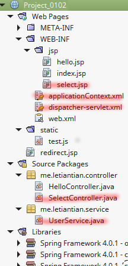
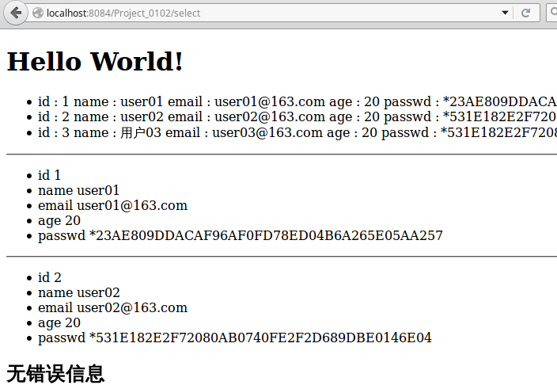

01-03、JdbcTemplate
---

JdbcTemplate是Spring MVC内置的对JDBC的一个封装。

## 数据库准备
MySQL 5.6。

```sql
--创建数据库
CREATE DATABASE IF NOT EXISTS `test` DEFAULT CHARSET utf8 COLLATE utf8_general_ci;
USE `test`;
--创建table
CREATE TABLE IF NOT EXISTS user
(
	`id` int AUTO_INCREMENT,
	`name` varchar(255),
 	`email` varchar(255),
 	`age` varchar(255),
	`passwd` varchar(255),
	PRIMARY KEY (`id`),
 	UNIQUE KEY (`name`),
	UNIQUE KEY (`email`)
) ENGINE=InnoDB DEFAULT CHARSET=utf8;
---插入若干数据
INSERT INTO user (`name`, `email`, `age`, `passwd`)
VALUES ('user01', 'user01@163.com', 20, password('123'));

INSERT INTO user (`name`, `email`, `age`, `passwd`)
VALUES ('user02', 'user02@163.com', 20, password('456'));

INSERT INTO user (`name`, `email`, `age`, `passwd`)
VALUES ('用户03', 'user03@163.com', 20, password('456'));
```

## 示例1
继续使用的上一节[01-02、使用Spring MVC构建Hello World](./01-02.md)中创建的项目。  

项目结构如下：  
  

图中红线下的文件是新增或者修改的文件。

MySQL的JDBC封装`mysql-connector-java-**.jar`别忘了放到Libraries里。

### 源码

**SelectController.java源码：**  
```java
package me.letiantian.controller;

import java.util.List;
import java.util.Map;
import javax.servlet.http.HttpServletRequest;
import javax.servlet.http.HttpServletResponse;
import org.springframework.beans.factory.annotation.Autowired;
import org.springframework.web.servlet.ModelAndView;
import org.springframework.web.servlet.mvc.Controller;
import org.springframework.jdbc.core.JdbcTemplate;

import me.letiantian.service.UserService;

public class SelectController implements  Controller{

    @Autowired
    private UserService userDao;

    @Autowired
    private JdbcTemplate jdbcTemplate;

    @Override
    public ModelAndView handleRequest(HttpServletRequest request, HttpServletResponse response) throws Exception {
        response.setContentType("text/html;charset=UTF-8");
        ModelAndView mv = new ModelAndView();

        List users = jdbcTemplate.queryForList("SELECT * FROM user");
        mv.addObject("users", users);

        Map user1 = userDao.getUserById(1);
        mv.addObject("user1", user1);

        Map user2 = jdbcTemplate.queryForMap("SELECT * FROM user WHERE id=2");
        mv.addObject("user2", user2);

        mv.addObject("message", "无错误信息");
        mv.setViewName("select");
        return mv;
    }

}
```

**UserService.java源码： **  
```java
package me.letiantian.service;

import java.util.Map;
import org.springframework.beans.factory.annotation.Autowired;
import org.springframework.jdbc.core.JdbcTemplate;
import org.springframework.stereotype.Service;

@Service
public class UserService {

    @Autowired
    private JdbcTemplate jdbcTemplate;

    public Map getUserById(int id) {

        Map user = jdbcTemplate.queryForMap("SELECT * FROM user WHERE id=?", new Object[] {id});
        return user;

    }

}
```

**select.jsp源码： **  
```html
<%@page contentType="text/html" pageEncoding="UTF-8"%>
<%@taglib prefix="c" uri="http://java.sun.com/jsp/jstl/core"%>
<!DOCTYPE html>
<html>
    <head>
        <meta http-equiv="Content-Type" content="text/html; charset=UTF-8">
        <title>JSP Page</title>
    </head>
    <body>
        <h1>Hello World!</h1>
	<c:if test="${not empty users}">
            <ul>
                <c:forEach var="user" items="${users}">
                    <li>
                        <c:forEach var="entry" items="${user}">    
                            <c:out value="${entry.key}" /> :   
                            <c:out value="${entry.value}" />    
                        </c:forEach>  
                    </li>
                </c:forEach>
            </ul>
	</c:if>

        <hr/>

        <c:if test="${not empty user1}">
            <ul>
                <c:forEach var="entry" items="${user1}">  
                    <li>
                        <c:out value="${entry.key}" />    
                        <c:out value="${entry.value}" />   
                    </li>
                </c:forEach>  
            </ul>
	</c:if>

        <hr/>

        <c:if test="${not empty user2}">
            <ul>
                <c:forEach var="entry" items="${user2}">  
                    <li>
                        <c:out value="${entry.key}" />    
                        <c:out value="${entry.value}" />   
                    </li>
                </c:forEach>  
            </ul>
	</c:if>
        <h2>${message}</h2>
    </body>
</html>
```

**dispatcher-servlet.xml源码：**  
```xml
<?xml version='1.0' encoding='UTF-8' ?>
<!-- was: <?xml version="1.0" encoding="UTF-8"?> -->
<beans xmlns="http://www.springframework.org/schema/beans"
       xmlns:xsi="http://www.w3.org/2001/XMLSchema-instance"
       xmlns:p="http://www.springframework.org/schema/p"
       xmlns:aop="http://www.springframework.org/schema/aop"
       xmlns:tx="http://www.springframework.org/schema/tx"
       xmlns:mvc="http://www.springframework.org/schema/mvc"
       xsi:schemaLocation="http://www.springframework.org/schema/beans http://www.springframework.org/schema/beans/spring-beans-4.0.xsd
       http://www.springframework.org/schema/aop http://www.springframework.org/schema/aop/spring-aop-4.0.xsd
       http://www.springframework.org/schema/tx http://www.springframework.org/schema/tx/spring-tx-4.0.xsd
       http://www.springframework.org/schema/mvc http://www.springframework.org/schema/mvc/spring-mvc-4.0.xsd">

    <bean class="org.springframework.web.servlet.mvc.support.ControllerClassNameHandlerMapping"/>

    <bean class="org.springframework.beans.factory.annotation.AutowiredAnnotationBeanPostProcessor"/>

    <bean id="urlMapping" class="org.springframework.web.servlet.handler.SimpleUrlHandlerMapping">
        <property name="mappings">
            <props>
                <prop key="index">indexController</prop>
                <prop key="hello">helloController</prop>
                <prop key="select">selectController</prop>
            </props>
        </property>
    </bean>

    <bean id="viewResolver"
          class="org.springframework.web.servlet.view.InternalResourceViewResolver"
          p:prefix="/WEB-INF/jsp/"
          p:suffix=".jsp" />

    <bean name="indexController"
          class="org.springframework.web.servlet.mvc.ParameterizableViewController"
          p:viewName="index" />

    <bean name="helloController"
          class="me.letiantian.controller.HelloController" />

    <bean name="selectController"
          class="me.letiantian.controller.SelectController" />

    <mvc:resources mapping="/static/**" location="/static/"/>  

</beans>
```

该文件中新增加了`selectController`，以及`<bean class="org.springframework.beans.factory.annotation.AutowiredAnnotationBeanPostProcessor"/>`以使得`@Autowired`能够工作。  

**applicationContext.xml源码：**  
```xml
<?xml version='1.0' encoding='UTF-8' ?>
<beans xmlns="http://www.springframework.org/schema/beans"
       xmlns:xsi="http://www.w3.org/2001/XMLSchema-instance"
       xmlns:p="http://www.springframework.org/schema/p"
       xmlns:aop="http://www.springframework.org/schema/aop"
       xmlns:tx="http://www.springframework.org/schema/tx"
       xmlns:context="http://www.springframework.org/schema/context"
       xsi:schemaLocation="http://www.springframework.org/schema/beans http://www.springframework.org/schema/beans/spring-beans-4.0.xsd
       http://www.springframework.org/schema/aop http://www.springframework.org/schema/aop/spring-aop-4.0.xsd
       http://www.springframework.org/schema/tx http://www.springframework.org/schema/tx/spring-tx-4.0.xsd
       http://www.springframework.org/schema/context http://www.springframework.org/schema/context/spring-context-4.0.xsd">

    <context:component-scan base-package="me.letiantian.controller" />
    <context:component-scan base-package="me.letiantian.service" />

    <bean id="dataSource"
          class="org.springframework.jdbc.datasource.DriverManagerDataSource"
          p:driverClassName="com.mysql.jdbc.Driver"
          p:url="jdbc:mysql://localhost:3306/test"
          p:username="root"
          p:password="123456" />

    <bean id="jdbcTemplate" class="org.springframework.jdbc.core.JdbcTemplate">
        <property name="dataSource" ref="dataSource"/>
    </bean>

</beans>
```
`dataSource`设置程MySQL，并注入到`jdbcTemplate`。

**运行项目，浏览器访问：**  
  


## 资料
**JdbcTemplate中的有多种查询方法，可以参考：**  
[JdbcTemplate 查询](http://www.cnblogs.com/shitianzeng/articles/2318995.html)  
[Spring JdbcTemplate方法详解](http://blog.csdn.net/dyllove98/article/details/7772463)  

**上面的JSP中用到了JSTL，以下几篇文件可以看一下：**  
[在JSTL EL中处理java.util.Map，及嵌套List的情况](http://my.oschina.net/letiantian/blog/511920)  
[JSP 标准标签库（JSTL）](http://www.runoob.com/jsp/jsp-jstl.html)  

**JdbcTemplate也可以使用事务，有声明式和编程式两种方法：**  
[Spring Declarative Transactions](http://www.simplespringtutorial.com/springDeclarativeTransactions.html)  
[Spring Programmatic Transactions](http://www.simplespringtutorial.com/springProgrammaticTransactions.html)  
[Spring Programmatic Transaction Management](http://www.tutorialspoint.com/spring/programmatic_management.htm)  
[Spring JdbcTemplate 与 事务管理](http://blog.sina.com.cn/s/blog_63f08ebf0100orev.html)  
[Transactions with JdbcTemplate](http://www.javacreed.com/transactions-with-jdbctemplate/)  


**如何使用连接池？**  
[JDBC Database connection pool in Spring FrameWork - How to SetUp Example](http://javarevisited.blogspot.jp/2012/06/jdbc-database-connection-pool-in-spring.html)  
[Setup Connection Pooling in Spring MVC](http://stackoverflow.com/questions/3552831/setup-connection-pooling-in-spring-mvc)

**其他：**  
[Spring MVC with JdbcTemplate Example](http://www.codejava.net/frameworks/spring/spring-mvc-with-jdbctemplate-example)  
[Spring MVC and List Example](http://www.mkyong.com/spring-mvc/spring-mvc-and-list-example/)  
