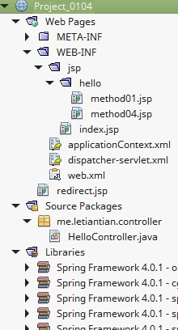
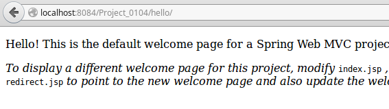
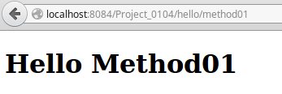
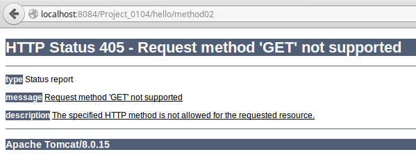
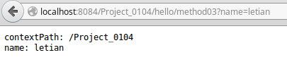
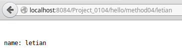
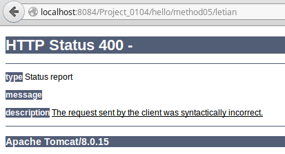
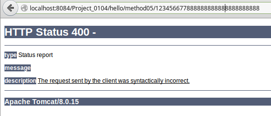
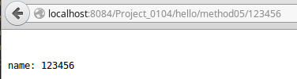

01-04、基于注解的URL映射
---


## 项目结构
创建项目`Pcrojet_0104`，最终结构如下：  
  

## 源码

### applicationContext.xml
```xml
<?xml version='1.0' encoding='UTF-8' ?>
<beans xmlns="http://www.springframework.org/schema/beans"
       xmlns:xsi="http://www.w3.org/2001/XMLSchema-instance"
       xmlns:p="http://www.springframework.org/schema/p"
       xmlns:aop="http://www.springframework.org/schema/aop"
       xmlns:tx="http://www.springframework.org/schema/tx"
       xmlns:context="http://www.springframework.org/schema/context"
       xmlns:mvc="http://www.springframework.org/schema/mvc"
       xsi:schemaLocation="http://www.springframework.org/schema/beans http://www.springframework.org/schema/beans/spring-beans-4.0.xsd
       http://www.springframework.org/schema/aop http://www.springframework.org/schema/aop/spring-aop-4.0.xsd
       http://www.springframework.org/schema/tx http://www.springframework.org/schema/tx/spring-tx-4.0.xsd
       http://www.springframework.org/schema/context http://www.springframework.org/schema/context/spring-context-4.0.xsd
       http://www.springframework.org/schema/mvc http://www.springframework.org/schema/mvc/spring-mvc-4.0.xsd
       http://www.springframework.org/schema/mvc http://www.springframework.org/schema/mvc/spring-mvc-4.0.xsd">

</beans>
```
该配置文件什么都没做。

### dispatcher-servlet.xml
```xml
<?xml version='1.0' encoding='UTF-8' ?>
<beans xmlns="http://www.springframework.org/schema/beans"
       xmlns:xsi="http://www.w3.org/2001/XMLSchema-instance"
       xmlns:p="http://www.springframework.org/schema/p"
       xmlns:aop="http://www.springframework.org/schema/aop"
       xmlns:tx="http://www.springframework.org/schema/tx"
       xmlns:context="http://www.springframework.org/schema/context"
       xmlns:mvc="http://www.springframework.org/schema/mvc"
       xsi:schemaLocation="http://www.springframework.org/schema/beans http://www.springframework.org/schema/beans/spring-beans-4.0.xsd
       http://www.springframework.org/schema/aop http://www.springframework.org/schema/aop/spring-aop-4.0.xsd
       http://www.springframework.org/schema/tx http://www.springframework.org/schema/tx/spring-tx-4.0.xsd
       http://www.springframework.org/schema/context http://www.springframework.org/schema/context/spring-context-4.0.xsd
       http://www.springframework.org/schema/mvc http://www.springframework.org/schema/mvc/spring-mvc-4.0.xsd">

    <context:component-scan base-package="me.letiantian.controller" />
    <mvc:annotation-driven/>

    <bean class="org.springframework.web.servlet.mvc.support.ControllerClassNameHandlerMapping"/>

    <bean id="urlMapping" class="org.springframework.web.servlet.handler.SimpleUrlHandlerMapping">
        <property name="mappings">
            <props>
                <prop key="index">indexController</prop>
            </props>
        </property>
    </bean>

    <bean id="viewResolver"
          class="org.springframework.web.servlet.view.InternalResourceViewResolver"
          p:prefix="/WEB-INF/jsp/"
          p:suffix=".jsp" />

    <bean name="indexController"
          class="org.springframework.web.servlet.mvc.ParameterizableViewController"
          p:viewName="index" />

</beans>
```

`<beans>`中增加了属性`xmlns:context`、`xmlns:mvc`，对应的在`xsi:schemaLocation`增加了:
```plain
http://www.springframework.org/schema/context http://www.springframework.org/schema/context/spring-context-4.0.xsd
http://www.springframework.org/schema/mvc http://www.springframework.org/schema/mvc/spring-mvc-4.0.xsd
```

关于`<mvc:annotation-driven/>`的意义，可参考[What's the difference between <mvc:annotation-driven /> and <context:annotation-config /> in servlet?](http://stackoverflow.com/questions/3977973/whats-the-difference-between-mvcannotation-driven-and-contextannotation)。  

### web.xml
是netbeans默认生成的配置。

### 模板文件

**index.jsp：**  
```html
<%@page contentType="text/html" pageEncoding="UTF-8"%>
<!DOCTYPE HTML PUBLIC "-//W3C//DTD HTML 4.01 Transitional//EN"
    "http://www.w3.org/TR/html4/loose.dtd">

<html>
    <head>
        <meta http-equiv="Content-Type" content="text/html; charset=UTF-8">
        <title>Welcome to Spring Web MVC project</title>
    </head>

    <body>
        <p>Hello! This is the default welcome page for a Spring Web MVC project.</p>
        <p><i>To display a different welcome page for this project, modify</i>
            <tt>index.jsp</tt> <i>, or create your own welcome page then change
                the redirection in</i> <tt>redirect.jsp</tt> <i>to point to the new
                welcome page and also update the welcome-file setting in</i>
            <tt>web.xml</tt>.</p>
    </body>
</html>
```

**hello/method01.jsp：**  
```html
<%@page contentType="text/html" pageEncoding="UTF-8"%>
<!DOCTYPE html>
<html>
    <head>
        <meta http-equiv="Content-Type" content="text/html; charset=UTF-8">
        <title>JSP Page</title>
    </head>
    <body>
        <h1>Hello Method01</h1>
    </body>
</html>
```

**hello/method04.jsp：**
```plain
<%@page contentType="text/plain" pageEncoding="UTF-8"%>

name: ${name}
```

### HelloController.java
```java
package me.letiantian.controller;

import java.io.PrintWriter;
import javax.servlet.http.HttpServletRequest;
import javax.servlet.http.HttpServletResponse;
import org.springframework.stereotype.Controller;
import org.springframework.ui.Model;
import org.springframework.web.bind.annotation.PathVariable;
import org.springframework.web.bind.annotation.RequestMapping;
import org.springframework.web.bind.annotation.RequestMethod;

@Controller
@RequestMapping("/hello")
public class HelloController{

    @RequestMapping(value = "")
    public String index() {
        return "index";
    }

    @RequestMapping(value = "/method01")
    public String method01() {
        return "hello/method01";
    }

	// 仅支持HTTP POST方法
    @RequestMapping(value = "/method02", method = {RequestMethod.POST})
    public String method02() {
        return "hello/method01";
    }

    @RequestMapping(value = "/method03")
    public void method03(HttpServletRequest request, HttpServletResponse response) {
        response.setContentType("text/plain;charset=UTF-8");
        try (PrintWriter out = response.getWriter()) {
            out.println("contextPath: " + request.getContextPath());
            out.println("name: " + request.getParameter("name"));
        } catch (Exception ex) {
            System.out.println(""+ex.getMessage());
        }
    }

    @RequestMapping(value = "/method04/{name}")
    public String method04(@PathVariable String name, Model model) {
        model.addAttribute("name", name);
        return "hello/method04";
    }

	@RequestMapping(value = "/method05/{id}")
    public String method05(@PathVariable int id, Model model) {
        model.addAttribute("name", id);
        return "hello/method04";
    }
}
```

## 测试

  
  
  
  
  
  
  
  

## 其他

**如何让一个方法映射多个URL？**   
很简单，例如`@RequestMapping(value = {"/hello", "/hi"})`。可参考[Spring MVC: Mapping Multiple URLs to Same Controller](http://stackoverflow.com/questions/3898442/spring-mvc-mapping-multiple-urls-to-same-controller)。

**如何自定义错误页面？**  
[Spring MVC : How To Return Custom 404 Error Pages](http://www.javabeat.net/spring-mvc-404-error-page/)  
[Spring MVC Exception Handling Example](http://www.mkyong.com/spring-mvc/spring-mvc-exception-handling-example/)  
[Exception Handling in Spring MVC](https://spring.io/blog/2013/11/01/exception-handling-in-spring-mvc)  
