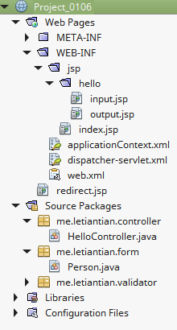
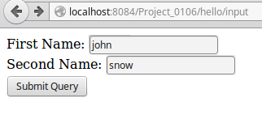
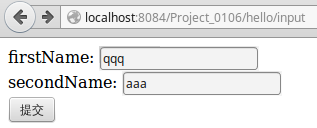
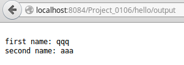
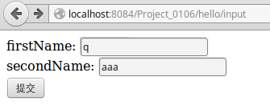
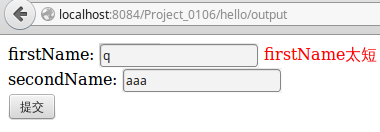
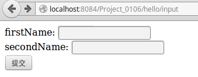
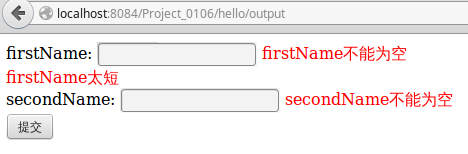

01-06、校验器
---

校验器，Validator。  

在处理一次带有表单数据的HTTP请求时候，通常这样做：

```plain
if (表单数据符合要求) {
	处理数据，返回结果；
} else {
	返回结果，提示用户重新输入数据；
}
```

判断表单数据是否符合要求这就是校验器该做的事情。我们可以自己编写校验类，也可以使用Spring MVC自带的相关类。

## 将表单数据绑定到对象中
项目结构如下：  


### 源码
**web.xml**  
```xml
<?xml version="1.0" encoding="UTF-8"?>
<web-app version="3.1" xmlns="http://xmlns.jcp.org/xml/ns/javaee" xmlns:xsi="http://www.w3.org/2001/XMLSchema-instance" xsi:schemaLocation="http://xmlns.jcp.org/xml/ns/javaee http://xmlns.jcp.org/xml/ns/javaee/web-app_3_1.xsd">
    <context-param>
        <param-name>contextConfigLocation</param-name>
        <param-value>/WEB-INF/applicationContext.xml</param-value>
    </context-param>
    <listener>
        <listener-class>org.springframework.web.context.ContextLoaderListener</listener-class>
    </listener>
    <servlet>
        <servlet-name>dispatcher</servlet-name>
        <servlet-class>org.springframework.web.servlet.DispatcherServlet</servlet-class>
        <load-on-startup>2</load-on-startup>
    </servlet>
    <servlet-mapping>
        <servlet-name>dispatcher</servlet-name>
        <url-pattern>/</url-pattern>
    </servlet-mapping>
    <session-config>
        <session-timeout>
            30
        </session-timeout>
    </session-config>
    <welcome-file-list>
        <welcome-file>redirect.jsp</welcome-file>
    </welcome-file-list>
</web-app>
```

**applicationContext.xml**  
```xml
<?xml version='1.0' encoding='UTF-8' ?>
<beans xmlns="http://www.springframework.org/schema/beans"
       xmlns:xsi="http://www.w3.org/2001/XMLSchema-instance"
       xmlns:p="http://www.springframework.org/schema/p"
       xmlns:aop="http://www.springframework.org/schema/aop"
       xmlns:tx="http://www.springframework.org/schema/tx"
       xsi:schemaLocation="http://www.springframework.org/schema/beans http://www.springframework.org/schema/beans/spring-beans-4.0.xsd
       http://www.springframework.org/schema/aop http://www.springframework.org/schema/aop/spring-aop-4.0.xsd
       http://www.springframework.org/schema/tx http://www.springframework.org/schema/tx/spring-tx-4.0.xsd">

</beans>
```

**dispatcher-servlet.xml**  
```xml
<?xml version='1.0' encoding='UTF-8' ?>
<beans xmlns="http://www.springframework.org/schema/beans"
       xmlns:xsi="http://www.w3.org/2001/XMLSchema-instance"
       xmlns:p="http://www.springframework.org/schema/p"
       xmlns:aop="http://www.springframework.org/schema/aop"
       xmlns:tx="http://www.springframework.org/schema/tx"
       xmlns:context="http://www.springframework.org/schema/context"
       xmlns:mvc="http://www.springframework.org/schema/mvc"
       xsi:schemaLocation="http://www.springframework.org/schema/beans http://www.springframework.org/schema/beans/spring-beans-4.0.xsd
       http://www.springframework.org/schema/aop http://www.springframework.org/schema/aop/spring-aop-4.0.xsd
       http://www.springframework.org/schema/tx http://www.springframework.org/schema/tx/spring-tx-4.0.xsd
       http://www.springframework.org/schema/context http://www.springframework.org/schema/context/spring-context-4.0.xsd
       http://www.springframework.org/schema/mvc http://www.springframework.org/schema/mvc/spring-mvc-4.0.xsd">

    <context:component-scan base-package="me.letiantian.controller" />
    <mvc:annotation-driven/>

    <bean class="org.springframework.web.servlet.mvc.support.ControllerClassNameHandlerMapping"/>

    <bean id="urlMapping" class="org.springframework.web.servlet.handler.SimpleUrlHandlerMapping">
        <property name="mappings">
            <props>
                <prop key="index">indexController</prop>
            </props>
        </property>
    </bean>

    <bean id="viewResolver"
          class="org.springframework.web.servlet.view.InternalResourceViewResolver"
          p:prefix="/WEB-INF/jsp/"
          p:suffix=".jsp" />

    <bean name="indexController"
          class="org.springframework.web.servlet.mvc.ParameterizableViewController"
          p:viewName="index" />

</beans>
```

**hello/input.jsp**
```html
<%@page contentType="text/html" pageEncoding="UTF-8"%>
<!DOCTYPE html>
<html>
    <head>
        <meta http-equiv="Content-Type" content="text/html; charset=UTF-8">
        <title>JSP Page</title>
    </head>
    <body>
        <form method="POST" action="${pageContext.request.contextPath}/hello/output">
            First Name: <input type="text" name="firstName"> <br/>
            Second Name: <input type="text" name="secondName"> <br/>
            <input type="submit" />

        </form>
    </body>
</html>
```

**hello/output.jsp**  
```plain
<%@page contentType="text/plain" pageEncoding="UTF-8"%>
first name: ${person.firstName}
second name: ${person.secondName}
```

**Person.java**  
```java
package me.letiantian.form;

public class Person {

    private String firstName;
    private String secondName;

    public String getFirstName() {
        return firstName;
    }

    public void setFirstName(String firstName) {
        this.firstName = firstName;
    }

    public String getSecondName() {
        return secondName;
    }

    public void setSecondName(String secondName) {
        this.secondName = secondName;
    }

}
```

**HelloController.java**  
```java
package me.letiantian.controller;

import java.io.PrintWriter;
import javax.servlet.http.HttpServletRequest;
import javax.servlet.http.HttpServletResponse;
import org.springframework.stereotype.Controller;
import org.springframework.ui.Model;
import org.springframework.web.bind.annotation.PathVariable;
import org.springframework.web.bind.annotation.RequestMapping;
import org.springframework.web.bind.annotation.RequestMethod;

import me.letiantian.form.Person;
import org.springframework.web.bind.annotation.ModelAttribute;

@Controller
@RequestMapping("/hello")
public class HelloController{

    @RequestMapping(value = "")
    public String index() {
        return "index";
    }

    @RequestMapping(value = "/input")
    public String input() {
        return "hello/input";
    }

    @RequestMapping(value = "/output")
    public String output(Person person, Model model) {
        model.addAttribute("person", person);
        return "hello/output";
    }

//    @RequestMapping(value = "/output")
//    public String output(@ModelAttribute(value="person") Person person, Model model) {
//        return "hello/output";
//    }

}
```

注意，
```java
    @RequestMapping(value = "/output")
    public String output(Person person, Model model) {
        model.addAttribute("person", person);
        return "hello/output";
    }
```
和
```java
    @RequestMapping(value = "/output")
    public String output(@ModelAttribute(value="person") Person person, Model model) {
        return "hello/output";
    }
```

是一样的。

### 浏览器访问

表单填入信息：  
  
提交表单后：  
  


## 校验数据

### hello/input.jsp修改如下
```html
<%@page contentType="text/html" pageEncoding="UTF-8"%>
<%@taglib prefix="c" uri="http://java.sun.com/jsp/jstl/core" %>
<%@taglib prefix="form" uri="http://www.springframework.org/tags/form" %>
<!DOCTYPE html>
<html>
    <head>
        <meta http-equiv="Content-Type" content="text/html; charset=UTF-8">
        <title> JSP Page</title>
        <style type="text/css">
            .error {color: red;}
        </style>
    </head>
    <body>

        <form:form modelAttribute="person" method="POST" action="${pageContext.request.contextPath}/hello/output">
            firstName: <form:input path="firstName" /> <form:errors path="firstName" cssClass="error"/> <br/>
            secondName: <form:input path="secondName" /> <form:errors path="secondName" cssClass="error"/> <br/>
            <input type="submit" value="提交" />
        </form:form>

    </body>
</html>
```

注意`<form:form modelAttribute="person" `。

### HelloController.java修改如下
```java
package me.letiantian.controller;

import org.springframework.stereotype.Controller;
import org.springframework.ui.Model;
import org.springframework.web.bind.annotation.RequestMapping;

import me.letiantian.form.Person;
import me.letiantian.validator.PersonValidator;
import org.springframework.validation.BindingResult;

@Controller
@RequestMapping("/hello")
public class HelloController{


    @RequestMapping(value = "")
    public String index() {
        return "index";
    }

    @RequestMapping(value = "/input")
    public String input(Model model) {
        model.addAttribute("person", new Person());  // 很重要
        return "hello/input";
    }

    @RequestMapping(value = "/output")
    public String output(Person person, BindingResult bindingResult, Model model) {
        model.addAttribute("person", person);  // 很重要
        PersonValidator pv = new PersonValidator();
        pv.validate(person, bindingResult);

        if (bindingResult.hasErrors()) {  // 如果有错误
            return "hello/input";
        }

        return "hello/output";

    }

}
```

注意每个方法中的`model.addAttribute("person")`是和`hello/input.jsp`中的`<form:form modelAttribute="person" `对应的。  
### 添加PersonValidator.java
该文件在包`me.letiantian.form.Person`下，内容为：  
```java
package me.letiantian.validator;

import me.letiantian.form.Person;
import org.springframework.validation.Errors;
import org.springframework.validation.Validator;
import org.springframework.validation.ValidationUtils;

public class PersonValidator implements Validator{

    @Override
    public boolean supports(Class<?> type) {
        return Person.class.isAssignableFrom(type);
    }

    @Override
    public void validate(Object o, Errors errors) {
        Person person = (Person) o;
        ValidationUtils.rejectIfEmptyOrWhitespace(errors, "firstName", null, "firstName不能为空");
        ValidationUtils.rejectIfEmptyOrWhitespace(errors, "secondName", null, "secondName不能为空");
        if (person.getFirstName().length() < 2) {
            errors.rejectValue("firstName", null, "firstName太短");
        }
    }
}
```

### 测试
第1组：  
  
  

第2组：
  
  

第3组：
  
  
