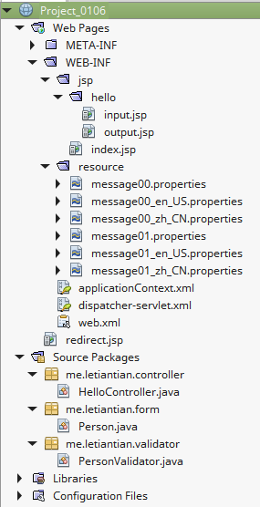
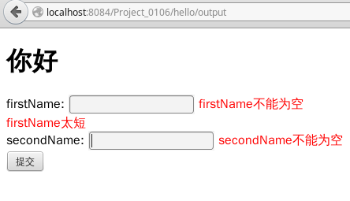
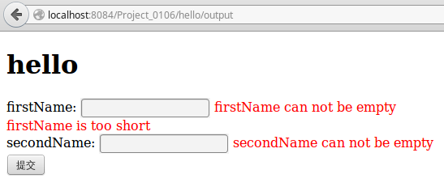

01-07、国际化
---

本节的项目以为[01-06、校验器](./01-06.md)创建的项目`Project_0106`为基础。  

所谓国际化，是指根据浏览器HTTP请求头中`Accept-Language`中指定的语言、或者用户指定的语言（Cookie、session中指定），
将web页面中的一些文本使用该语言展示出来。

## 根据浏览器HTTP请求头中`Accept-Language`指定的语言进行国际化

项目结构如下：  
  

### 源码
这里只展示改动或者新增的文件。

**dispatcher-servlet.xml**  
```xml
<?xml version='1.0' encoding='UTF-8' ?>
<beans xmlns="http://www.springframework.org/schema/beans"
       xmlns:xsi="http://www.w3.org/2001/XMLSchema-instance"
       xmlns:p="http://www.springframework.org/schema/p"
       xmlns:aop="http://www.springframework.org/schema/aop"
       xmlns:tx="http://www.springframework.org/schema/tx"
       xmlns:context="http://www.springframework.org/schema/context"
       xmlns:mvc="http://www.springframework.org/schema/mvc"
       xsi:schemaLocation="http://www.springframework.org/schema/beans http://www.springframework.org/schema/beans/spring-beans-4.0.xsd
       http://www.springframework.org/schema/aop http://www.springframework.org/schema/aop/spring-aop-4.0.xsd
       http://www.springframework.org/schema/tx http://www.springframework.org/schema/tx/spring-tx-4.0.xsd
       http://www.springframework.org/schema/context http://www.springframework.org/schema/context/spring-context-4.0.xsd
       http://www.springframework.org/schema/mvc http://www.springframework.org/schema/mvc/spring-mvc-4.0.xsd">

    <context:component-scan base-package="me.letiantian.controller" />
    <mvc:annotation-driven/>

    <bean class="org.springframework.web.servlet.mvc.support.ControllerClassNameHandlerMapping"/>

    <bean id="urlMapping" class="org.springframework.web.servlet.handler.SimpleUrlHandlerMapping">
        <property name="mappings">
            <props>
                <prop key="index">indexController</prop>
            </props>
        </property>
    </bean>

    <bean id="viewResolver"
          class="org.springframework.web.servlet.view.InternalResourceViewResolver"
          p:prefix="/WEB-INF/jsp/"
          p:suffix=".jsp" />

    <bean name="indexController"
          class="org.springframework.web.servlet.mvc.ParameterizableViewController"
          p:viewName="index" />

    <!-- 国际化 -->
    <bean id="messageSource" class="org.springframework.context.support.ReloadableResourceBundleMessageSource">
        <property name="basenames">
            <list>
                <value>/WEB-INF/resource/message00</value>
                <value>/WEB-INF/resource/message01</value>
            </list>
        </property>
    </bean>

    <bean id="localeResolver" class="org.springframework.web.servlet.i18n.AcceptHeaderLocaleResolver">

    </bean>
</beans>
```

**message00.properties**  
```plain
welcome=hello
person.firstName.notempty=firstName can not be empty
person.secondName.notempty=secondName can not be empty
person.firstName.tooshort=firstName is too short
```

**message00_en_US.properties**  
```plain
welcome=hello
person.firstName.notempty=firstName can not be empty
person.secondName.notempty=secondName can not be empty
person.firstName.tooshort=firstName is too short
```
**message00_zh_CN.properties**  
```plain
welcome=你好
person.firstName.notempty=firstName不能为空
person.secondName.notempty=secondName不能为空
person.firstName.tooshort=firstName太短
```
**message01\*.properties**  
这三个文件为空。  

**PersonValidator.java**  
```java
package me.letiantian.validator;

import me.letiantian.form.Person;
import org.springframework.validation.Errors;
import org.springframework.validation.Validator;
import org.springframework.validation.ValidationUtils;

public class PersonValidator implements Validator{

    @Override
    public boolean supports(Class<?> type) {
        return Person.class.isAssignableFrom(type);
    }

    @Override
    public void validate(Object o, Errors errors) {
        Person person = (Person) o;
        ValidationUtils.rejectIfEmptyOrWhitespace(errors, "firstName", "person.firstName.notempty");
        ValidationUtils.rejectIfEmptyOrWhitespace(errors, "secondName", "person.secondName.notempty");
        if (person.getFirstName().length() < 2) {
            errors.rejectValue("firstName", "person.firstName.tooshort");
        }
    }

}
```
**hello/input.jsp**  
```html
<%@page contentType="text/html" pageEncoding="UTF-8"%>
<%@taglib prefix="c" uri="http://java.sun.com/jsp/jstl/core" %>
<%@taglib prefix="form" uri="http://www.springframework.org/tags/form" %>
<%@taglib prefix="spring" uri="http://www.springframework.org/tags"%>
<!DOCTYPE html>
<html>
    <head>
        <meta http-equiv="Content-Type" content="text/html; charset=UTF-8">
        <title> JSP Page</title>
        <style type="text/css">
            .error {color: red;}
        </style>
    </head>
    <body>
        <h1><spring:message code="welcome" /></h1>
        <form:form modelAttribute="person" method="POST" action="${pageContext.request.contextPath}/hello/output">
            firstName: <form:input path="firstName" /> <form:errors path="firstName" cssClass="error"/> <br/>
            secondName: <form:input path="secondName" /> <form:errors path="secondName" cssClass="error"/> <br/>
            <input type="submit" value="提交" />
        </form:form>

    </body>
</html>
```

### 效果
可以参考[Change Mozilla Firefox language settings](http://pchelp.ricmedia.com/change-mozilla-firefox-language-settings/)修改火狐浏览器的Accept-Language。
如果没有效果，可以使用netbeans重启项目，再查看效果。  

  

  

## 其他方式的国际化

上面的程序中`localeResolver`使用的`AcceptHeaderLocaleResolver`（见配置文件`dispatcher-servlet.xml`）。
另外，Spring还给出`SessionLocaleResolver`、`CookieLocaleResolver`来实现国际化。也可以根据URL中的指定的Locale进行国际化。  

可以参考：  
[SpringMVC学习系列（8） 之 国际化](http://www.cnblogs.com/liukemng/p/3750117.html)  
[Spring MVC internationalization example](http://www.mkyong.com/spring-mvc/spring-mvc-internationalization-example)  
