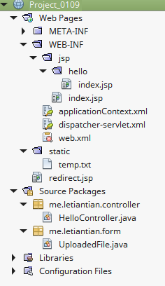
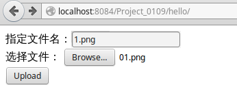
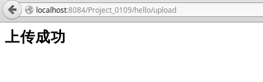
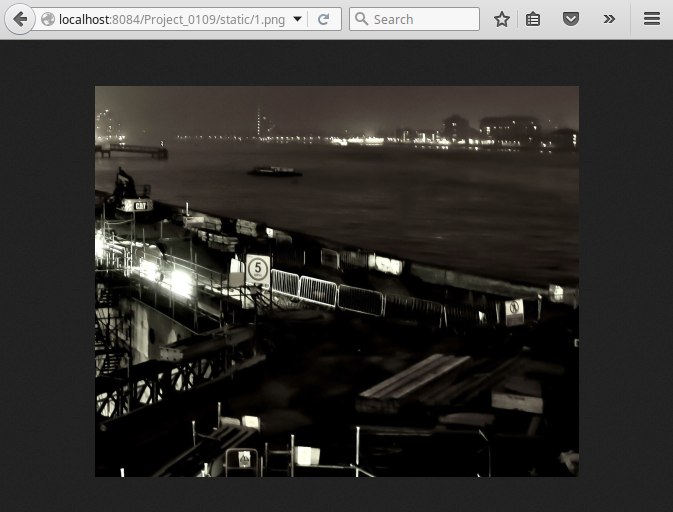

01-09、文件上传
---

先看一下Servlet是如何处理文件上传的：  
[Servlets - File Uploading](http://www.tutorialspoint.com/servlets/servlets-file-uploading.htm)  
[Java File Upload Example with Servlet 3.0 API](http://www.codejava.net/java-ee/servlet/java-file-upload-example-with-servlet-30-api)  

Spring MVC下的处理是类似的。

下面展示一个简单的实现。  

## 项目结构与源码
  

### web.xml
```xml
<?xml version="1.0" encoding="UTF-8"?>
<web-app version="3.1" xmlns="http://xmlns.jcp.org/xml/ns/javaee" xmlns:xsi="http://www.w3.org/2001/XMLSchema-instance" xsi:schemaLocation="http://xmlns.jcp.org/xml/ns/javaee http://xmlns.jcp.org/xml/ns/javaee/web-app_3_1.xsd">
    <context-param>
        <param-name>contextConfigLocation</param-name>
        <param-value>/WEB-INF/applicationContext.xml</param-value>
    </context-param>
    <listener>
        <listener-class>org.springframework.web.context.ContextLoaderListener</listener-class>
    </listener>
    <servlet>
        <servlet-name>dispatcher</servlet-name>
        <servlet-class>org.springframework.web.servlet.DispatcherServlet</servlet-class>
        <load-on-startup>2</load-on-startup>
        <multipart-config>
            <file-size-threshold>1000000</file-size-threshold>
            <max-file-size>2000000</max-file-size>
            <max-request-size>4000000</max-request-size>
        </multipart-config>
    </servlet>
    <servlet-mapping>
        <servlet-name>dispatcher</servlet-name>
        <url-pattern>/</url-pattern>
    </servlet-mapping>
    <session-config>
        <session-timeout>
            30
        </session-timeout>
    </session-config>
    <welcome-file-list>
        <welcome-file>redirect.jsp</welcome-file>
    </welcome-file-list>
</web-app>
```

注意其中的限制文件大小的配置：
```xml
<multipart-config>
    <file-size-threshold>1000000</file-size-threshold>
    <max-file-size>2000000</max-file-size>
    <max-request-size>4000000</max-request-size>
</multipart-config>
```

### applicationContext.xml
```xml
<?xml version='1.0' encoding='UTF-8' ?>
<!-- was: <?xml version="1.0" encoding="UTF-8"?> -->
<beans xmlns="http://www.springframework.org/schema/beans"
       xmlns:xsi="http://www.w3.org/2001/XMLSchema-instance"
       xmlns:p="http://www.springframework.org/schema/p"
       xmlns:aop="http://www.springframework.org/schema/aop"
       xmlns:tx="http://www.springframework.org/schema/tx"
       xsi:schemaLocation="http://www.springframework.org/schema/beans http://www.springframework.org/schema/beans/spring-beans-4.0.xsd
       http://www.springframework.org/schema/aop http://www.springframework.org/schema/aop/spring-aop-4.0.xsd
       http://www.springframework.org/schema/tx http://www.springframework.org/schema/tx/spring-tx-4.0.xsd">

</beans>
```

### dispatcher-servlet.xml
```xml
<?xml version='1.0' encoding='UTF-8' ?>
<beans xmlns="http://www.springframework.org/schema/beans"
       xmlns:xsi="http://www.w3.org/2001/XMLSchema-instance"
       xmlns:p="http://www.springframework.org/schema/p"
       xmlns:aop="http://www.springframework.org/schema/aop"
       xmlns:tx="http://www.springframework.org/schema/tx"
       xmlns:context="http://www.springframework.org/schema/context"
       xmlns:mvc="http://www.springframework.org/schema/mvc"
       xsi:schemaLocation="http://www.springframework.org/schema/beans http://www.springframework.org/schema/beans/spring-beans-4.0.xsd
       http://www.springframework.org/schema/aop http://www.springframework.org/schema/aop/spring-aop-4.0.xsd
       http://www.springframework.org/schema/tx http://www.springframework.org/schema/tx/spring-tx-4.0.xsd
       http://www.springframework.org/schema/context http://www.springframework.org/schema/context/spring-context-4.0.xsd
       http://www.springframework.org/schema/mvc http://www.springframework.org/schema/mvc/spring-mvc-4.0.xsd">

    <context:component-scan base-package="me.letiantian.controller" />
    <context:component-scan base-package="me.letiantian.form" />
    <mvc:annotation-driven/>

    <bean id="multipartResolver"
          class="org.springframework.web.multipart.support.StandardServletMultipartResolver">
    </bean>

    <bean class="org.springframework.web.servlet.mvc.support.ControllerClassNameHandlerMapping"/>

    <bean id="urlMapping" class="org.springframework.web.servlet.handler.SimpleUrlHandlerMapping">
        <property name="mappings">
            <props>
                <prop key="index">indexController</prop>
            </props>
        </property>
    </bean>

    <bean id="viewResolver"
          class="org.springframework.web.servlet.view.InternalResourceViewResolver"
          p:prefix="/WEB-INF/jsp/"
          p:suffix=".jsp" />

    <bean name="indexController"
          class="org.springframework.web.servlet.mvc.ParameterizableViewController"
          p:viewName="index" />

     <mvc:resources mapping="/static/**" location="/static/"/>

</beans>
```

注意，这里增加了一个multipart解析器`StandardServletMultipartResolver`，用来处理上传的文件。`/static`是存放静态资源的目录，
我们也准备将上传的文件放到这个目录里。

### UploadedFile.java
```java
package me.letiantian.form;

import org.springframework.web.multipart.MultipartFile;

public class UploadedFile {
    private String fileName;
    private MultipartFile multipartFile;

    public String getFileName() {
        return fileName;
    }

    public void setFileName(String fileName) {
        this.fileName = fileName;
    }

    public MultipartFile getMultipartFile() {
        return multipartFile;
    }

    public void setMultipartFile(MultipartFile multipartFile) {
        this.multipartFile = multipartFile;
    }

}
```

### HelloController.java

```java
package me.letiantian.controller;

import java.io.File;
import java.io.IOException;
import java.io.PrintWriter;
import javax.servlet.http.HttpServletRequest;
import javax.servlet.http.HttpServletResponse;
import org.springframework.stereotype.Controller;
import org.springframework.web.bind.annotation.RequestMapping;
import me.letiantian.form.UploadedFile;
import org.springframework.web.bind.annotation.ModelAttribute;

import org.springframework.web.multipart.MultipartFile;

@Controller
@RequestMapping("/hello")
public class HelloController{


    @RequestMapping(value = "")
    public String index() {
        return "hello/index";
    }

    @RequestMapping(value = "/upload")
    public void output(@ModelAttribute UploadedFile uploadedFile,
            HttpServletRequest request,
            HttpServletResponse response) throws IOException {    
        response.setContentType("text/html;charset=UTF-8");
        PrintWriter out = response.getWriter();
        MultipartFile multiPartFile = uploadedFile.getMultipartFile();
        System.out.println("文件原始名称："+multiPartFile.getOriginalFilename());
        System.out.println("表单给定的文件名称："+uploadedFile.getFileName());

        try{
            System.out.println("上传目录："+request.getServletContext().getRealPath("/static"));
            File file = new File(request.getServletContext().getRealPath("/static"),
                    uploadedFile.getFileName());
            multiPartFile.transferTo(file);  // 将文件写入本地
            out.println("<h2>上传成功</h2>");
        } catch (Exception ex) {
            System.out.println(""+ex.getMessage());
            out.println("<h2>上传失败</h2>");
        }
    }

}
```
注意，表单数据北绑定到了`uploadedFile`对象中。

### hello/index.jsp
```html
<%@page contentType="text/html" pageEncoding="UTF-8"%>
<!DOCTYPE html>
<html>
    <head>
        <meta http-equiv="Content-Type" content="text/html; charset=UTF-8">
        <title>JSP Page</title>
    </head>
    <body>
        <form method="post" action="${pageContext.request.contextPath}/hello/upload" enctype="multipart/form-data">
            指定文件名：<input type="text" name="fileName" /> <br/>
            选择文件： <input type="file" name="multipartFile" size="60"/> <br/>
            <input type="submit" value="Upload" />
        </form>
    </body>
</html>
```

## 测试程序
选择文件，指定名称：  


上传成功：  


查看上传的文件：  


Tomcat输出：
```plain
文件原始名称：01.png
表单给定的文件名称：1.png
上传目录：/data/Code/netbeans/Project_0109/build/web/static
```

## 资料
《Spring MVC学习指南》 第11章
